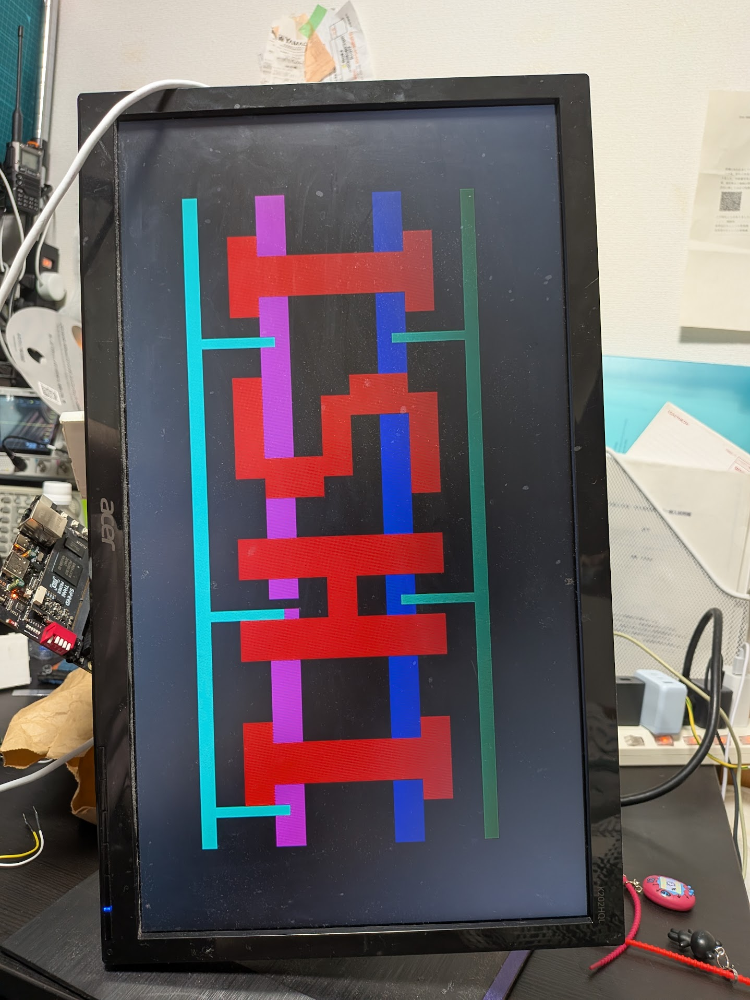
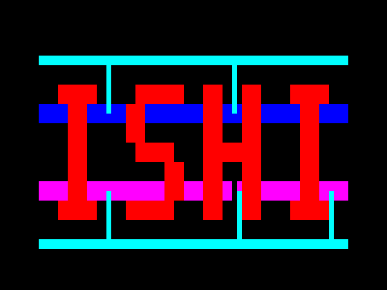

# ISHI VGA — OpenSUSI TR-1um

ISHI会ロゴをVGAに出力する固定映像回路です。

| 項目 | 仕様 |
|---|---|
| 映像出力 | 640×480・60 Hz相当、RGB111 |
| クロック | 外部3.15 MHz |
| 電源 | VDD=5 V、VSS=0 V |
| 端子数 | 8（共通VSSを除くと7） |
| コア外形 | 1792.8 × 897.2 µm（1800 × 900 µm枠） |
| PDK | [TR-1um](https://github.com/OpenSUSI/TR-1um) dev / `f408d3b` に固定 |
| スタンダードセル | 岡村氏の[APRtools](https://github.com/jun1okamura/TR-1um_APRtools) / `v59_4` |

[提出物](submission/README.md) · [仕様・端子](submission/SPEC.md) · [GDS](submission/ishi_vga.gds) · [再検証方法](submission/REPRODUCE.md) · [FPGA試験](docs/FPGA_BRINGUP.md)

フレーム未統合のコアです。検証結果と残件は仕様書に記載しています。

Tang Primer 20K＋抵抗DACでのVGA実機表示（2026-09-25）。

ゲートシミュレーションで観測した表示画像。

