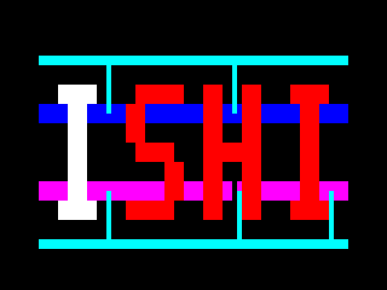
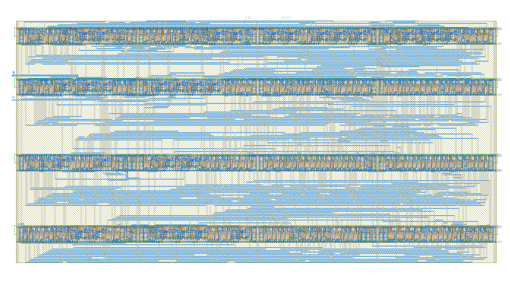

# ISHI VGA — 文字点灯＋消灯段階

**I → S → H → I → 発光なし**を繰り返すVGAコアです。各段階16フレーム、1周約1.33秒。発光なしの段階では元のロゴを表示します。

**1792.8×897.2 µm、VDD込み7端子（共通VSSを除く）。** 外部CLK 3.15 MHz、640×480・60 Hz相当、RGB111。固定した岡村氏の[APRtools](https://github.com/jun1okamura/TR-1um_APRtools)／v59_4を使い、既存コアの空き領域へ34セルを追加しました。

| 内容 | ファイル |
|---|---|
| GDS | [ishi_vga.gds](ishi_vga.gds) — top `ishi_vga_core` |
| GDSからの抽出回路 | [ishi_vga.extracted](ishi_vga.extracted) |
| LVS参照回路 | [ishi_vga_lvs.spice](ishi_vga_lvs.spice) |
| RTL・ゲート回路 | [RTL](source/ishi_vga_core.v)・[描画](source/ishi_logo.v)・[ゲート](source/ishi_vga_core_pnr.v) |
| コア端子の位置 | [ports.json](ports.json) |
| 物理・機能検証 | [verification.json](verification/verification.json) |
| FPGAデータ | [vga_letter_animation.fs](fpga/vga_letter_animation.fs)・[書き込みログ](fpga/program.log) |
| 仕様・再現手順 | [LETTER_SCAN_IMPLEMENTATION.md](../../docs/LETTER_SCAN_IMPLEMENTATION.md) |

描画DRC 0件、strict LVS一致。RTLとゲート回路の80フレーム・420万クロック、全128二値カウンタ初期状態を照合しました。セル遅延STAはsetup余裕274.527 ns、hold余裕6.687 nsです。Tang Primer 20KへのSRAM書き込みも完了しています。

ゲートシミュレーションで観測した5段階の表示：

格納ファイルの整合性は `python3 tools/verify_bundle.py` で確認できます。端子名・位置は元のコアと同じです。これはフレーム統合前のコアで、検証範囲は上記の仕様書に記録しています。
